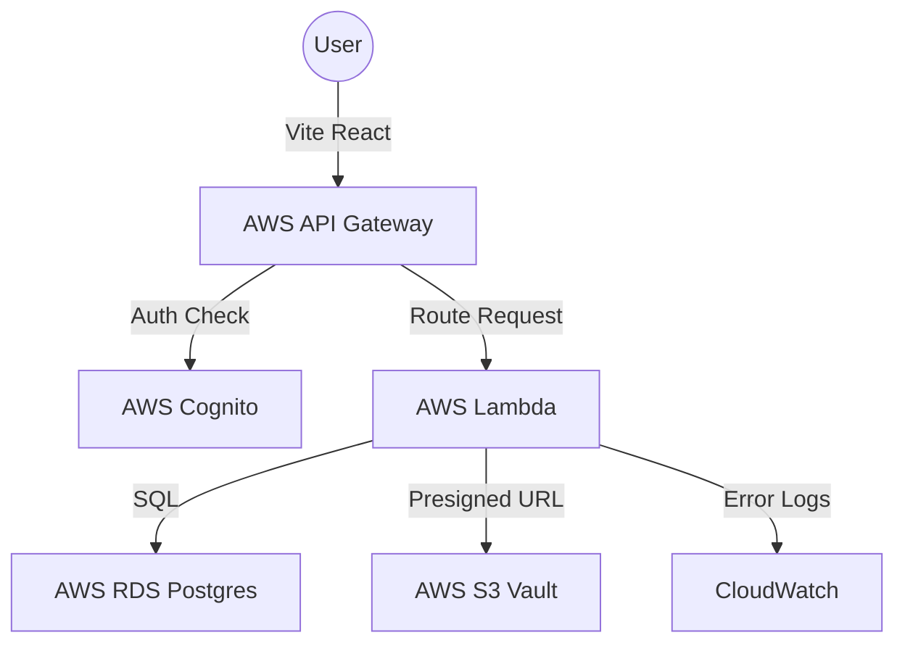

# MyVidyon ERP: The Complete AWS Handbook 🚀

Welcome to the **MyVidyon ERP** core repository. This project is a modern, scalable Educational Resource Planning system built with React, Vite, and a serverless AWS backend.

---

## 🏗️ 1. Infrastructure Architecture
This ERP runs on a "Full-Stack Serverless" architecture on AWS, ensuring high availability and low cost.



- **React Frontend**: Modern UI with real-time dashboard tracking.
- **API Gateway**: The "Front Door" that manages all secure endpoints.
- **AWS Lambda**: 22+ microservices handling all business logic.
- **RDS Postgres**: A modular relational database for academic and financial data.
- **AWS Cognito**: Secure user identity, roles, and campus isolation.
- **AWS S3**: Secure storage for student assignments and faculty materials.

---

## 📂 2. Project Structure
```text
my-vidyon/
├── database/                # Modular SQL Source of Truth
│   └── modules/             # Schema split by domain (Institute, Staff, etc.)
├── lambda-functions/        # All 22+ Backend Services
│   ├── admin/               # Onboarding & Platform Stats
│   ├── faculty/             # Attendance, Marks, Exams
│   ├── institution/         # Campus Analytics & Users
│   ├── parents/             # Child Tracking & Fees
│   ├── students/            # Learning Management
│   └── common/              # Shared DB & S3 logic
├── src/                     # React / Vite Frontend
│   ├── components/          # Reusable UI Blocks
│   ├── pages/               # Functional Dashboards
│   └── services/api.ts      # Frontend API Service Layer
└── README.md                # This Guide
```

---

## 🐳 3. Database Setup (pgAdmin)
We use a **Modular Schema** for better maintainability. To initialize your database, open pgAdmin and follow the module-based setup guide.

👉 **[View pgAdmin Database Guide](file:///c:/Users/kamal/MY-VIDYON%20PROJECTS/my-vidyon-erp/my-vidyon/README.md#database-setup)**

---

## 🌩️ 4. The Lambda Deployment Handbook
For every backend function, we have provided an ultra-granular 7-step guide.

👉 **[Detailed Lambda Deployment Handbook](file:///c:/Users/kamal/MY-VIDYON%20PROJECTS/my-vidyon-erp/my-vidyon/LAMBDA_DEPLOY_HANDBOOK.md)**

---

## 🚪 5. API Gateway Setup Guide
The "Front Door" allows your React app to communicate with Lambda. Follow our point-and-click guide.

👉 **[Detailed API Gateway Setup Guide](file:///c:/Users/kamal/MY-VIDYON%20PROJECTS/my-vidyon-erp/my-vidyon/API_GATEWAY_HANDBOOK.md)**

---

## 🔐 6. Secondary Infrastructure (Cognito & S3)
For setting up S3 storage and Cognito attributes, please refer to the infrastructure supplement.

👉 **[AWS Infrastructure Supplement](file:///c:/Users/kamal/MY-VIDYON%20PROJECTS/my-vidyon-erp/my-vidyon/AWS_INFRA_SUPPLEMENT.md)**

---

## 📜 7. Complete API & Lambda Mapping
*(Refer to the [Lambda Handbook](file:///c:/Users/kamal/MY-VIDYON%20PROJECTS/my-vidyon-erp/my-vidyon/LAMBDA_DEPLOY_HANDBOOK.md) for the full mapping list of all 22 endpoints).*

---

## 🛠️ 7. Local Development
To run the project on your machine:

```bash
npm install        # Install Frontend Dependencies
npm run dev        # Launch Vite Dev Server at localhost:5173
```

> [!IMPORTANT]
> **Production Tip**: Always click **"Deploy API"** in the API Gateway console after making any changes, otherwise your React app will keep using the old versions! village
